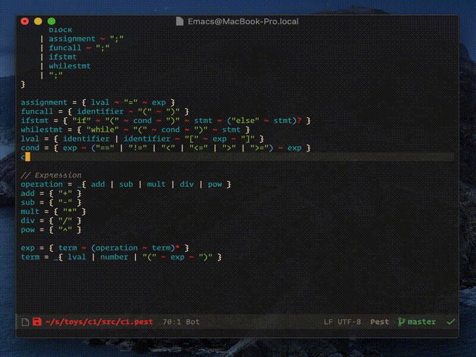
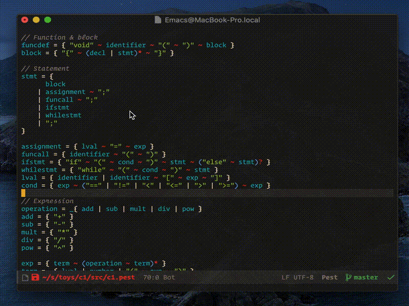
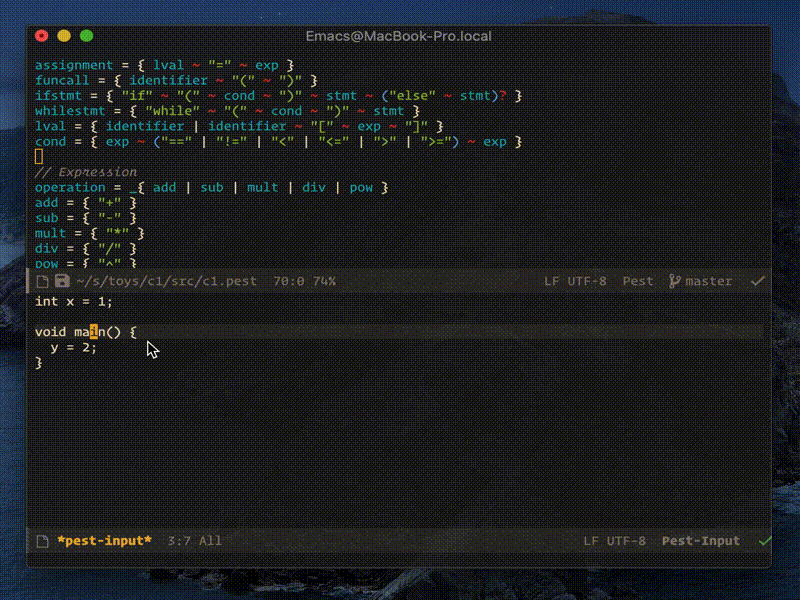

# Pest mode

Pest mode provides a major mode for editing Pest files.  It also contains a few advanced features.

Current stable version: 0.1.

Pest-mode features:
* Syntax highlighting
* Indentation
* Imenu integration
* xref integration
* Eldoc integration (requires `pesta`)
* Flymake/flycheck integration for syntax checking (requires `pesta`)
* Language studio, where you can experiment the grammar (requires `pesta`)

## Installation

`pest-mode`, `flymake-pest`, and `flycheck-pest` are now on MELPA.

+ Just `M-x package-install` both `pest-mode` and `flymake-pest`.
+ Install `pesta` (see below).

### pest-mode

To manually install `pest-mode`, download the file and put it in your `load-path`, and write in your config file:

```emacs-lisp
(autoload 'pest-mode "pest-mode")
(add-to-list #'auto-mode-alist '("\\.pest\\'" . pest-mode))
```

If you use `use-package` and `quelpa`, life is easier:

```emacs-lisp
(use-package pest-mode
  :quelpa (pest-mode :fetcher github :repo "ksqsf/pest-mode")
  :mode "\\.pest\\'"
  :hook (pest-mode . flymake-mode))
```

### pesta

To use the more advanced features, you must have `pesta` installed.

`pesta` is now on crates.io, so just do

+ `cargo install pesta --force`

Or, if you prefer the manual way,

1. [Install the Rust toolchain](https://rustup.rs).
2. `cd pesta && cargo build --release`
3. Find the executable `pesta` under `target/release`, and
   (optionally) put it in your `PATH`.

Note: you have to customize `pest-pesta-executable` if `pesta` is not
in your `PATH`.

## Usage

If you have added `pest-mode` to `auto-mode-alist`, then it should be enabled automatically on any `.pest` file.

In a `.pest` file,

+ `pest-test-input` (default keybinding `C-c C-t`): open a buffer to test the current grammar
+ `flymake-mode`: enable syntax checking

In a testing buffer,

+ `pest-select-rule` (default keybinding `C-c C-r`): select the start rule for all other purposes
+ `pest-analyze-input` (default keybinding `C-c C-c`): analyze the input and report the structure
+ `flymake-mode` (enabled by default): enable syntax checking
+ `eldoc-mode` (enabled by default): enable displaying the parse tree path

## Demo

All of the following require `pesta`.

### Pest-mode supports flymake!



### The testing buffer supports both flymake and eldoc!



### Analyze


